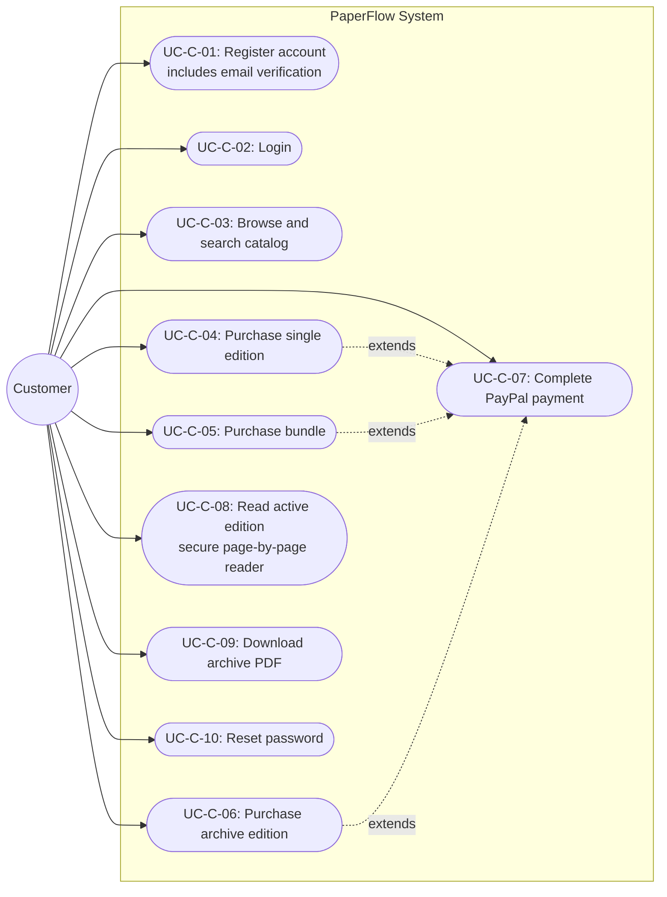
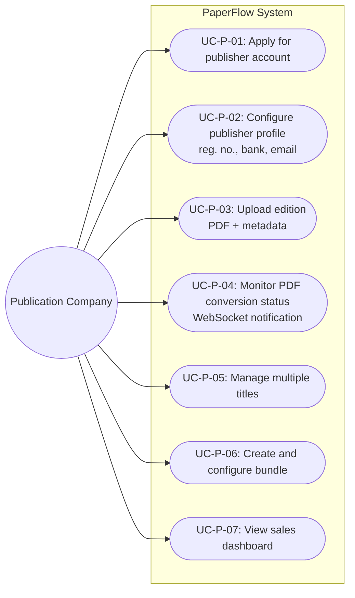
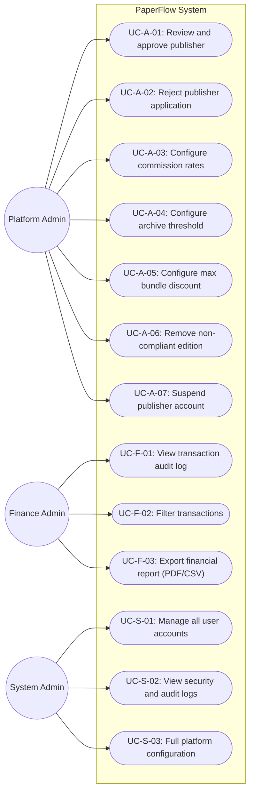

# PaperFlow — Design Specification Document
## Digital Newspaper and Magazine Publishing, Selling, and Buying Platform

---

## Table of Contents

1. [Introduction](#1-introduction)
2. [Technology Stack](#2-technology-stack)
3. [System Architecture Overview](#3-system-architecture-overview)
4. [Stakeholders and Roles](#4-stakeholders-and-roles)
5. [DFD Level 0 — Context Diagram](#5-dfd-level-0--context-diagram)
6. [Use Case Diagrams](#6-use-case-diagrams)
7. [Security Design](#7-security-design)
8. [Appendix](#8-appendix)

---

## 1. Introduction

### 1.1 Purpose
This document defines the complete design specification for PaperFlow — a digital newspaper and magazine publishing, selling, and buying platform built for the Sri Lankan publication industry.

### 1.2 Background
Publishers currently distribute digital editions informally via Telegram and WhatsApp, resulting in piracy and revenue loss. PaperFlow provides a centralized, secure marketplace with IP protection, commission tracking, and role-specific reporting.

### 1.3 Scope
- Secure edition publishing, purchasing, and reading
- Server-side watermarking and signed token delivery
- PayPal-integrated marketplace with commission management
- Role-based dashboards for publishers, admins, and finance auditors
- Archive management with scheduled edition lifecycle transitions

---

## 2. Technology Stack

PaperFlow's backend runs as a single Spring Boot monolith — one deployable unit that keeps operations simple at the platform's current scale — while the frontend is built in React for a component-based UI that integrates directly with the PayPal SDK. All relational data is stored in a single MySQL instance, preserving referential integrity and a single source of truth across publishers, editions, orders, and accounts.

### 2.1 Backend — Spring Boot
| Component | Technology |
|---|---|
| Framework | Spring Boot  |
| Security | Spring Security + Session (HttpSession) |
| ORM | Spring Data JPA + Hibernate |
| Async Processing | Spring @Async with ThreadPoolTaskExecutor |
| Scheduling | Spring @Scheduled (midnight archive job) |
| WebSocket | Spring WebSocket (STOMP) |
| PDF Processing | Apache PDFBox (page splitting + image rendering) |
| Image Watermarking | Java AWT and ImageIO |
| Email | Spring Mail (JavaMailSender) |
| Build | Maven |

### 2.2 Frontend — React
| Component | Technology |
|---|---|
| Web Frontend | React |
| Mobile Client | React Native |

### 2.3 Infrastructure
| Component | Technology |
|---|---|
| Database | SQL Server  |
| File Storage | Local filesystem (backend server-mounted) |
| Email Delivery | GMAIL SMTP server (external) |
| Payment Gateway | PayPal REST API (external) |

---

## 3. System Architecture Overview

```
  ┌─────────────────────────────────────────────────────────────────────┐
  │                        CLIENT LAYER                                 │
  │                                                                     │
  │   ┌──────────────────────────────────────────────────────────┐      │
  │   │      React SPA (Browser) + React Native Mobile App       │      │
  │   │                                                          │      │
  │   └──────────────────────────┬───────────────────────────────┘      │
  └──────────────────────────────│──────────────────────────────────────┘
                                 │  HTTPS / TLS 
                                 │  Session Cookie 
                                 │  
  ┌──────────────────────────────▼──────────────────────────────────────┐
  │                     SPRING BOOT MONOLITH                            │
  │                                                                     │
  │  ┌─────────────┐  ┌─────────────┐  ┌─────────────┐  ┌──────────┐    │
  │  │  Auth &     │  │  Publisher  │  │  Marketplace│  │  Secure  │    │
  │  │  RBAC       │  │  Portal     │  │  & Payment  │  │  Reader  │    │
  │  │             │  │             │  │             │  │          │    │
  │  └─────────────┘  └─────────────┘  └─────────────┘  └──────────┘    │
  │                                                                     │
  │  ┌─────────────┐  ┌─────────────┐  ┌─────────────┐  ┌──────────┐    │
  │  │  Platform   │  │  Finance    │  │  Async PDF  │  │ WebSocket│    │
  │  │  Admin      │  │  Admin      │  │  Thread     │  │ Notifier │    │
  │  │  Controller │  │             │  │  Executor   │  │          │    │
  │  └─────────────┘  └─────────────┘  └─────────────┘  └──────────┘    │
  │                                                                     │
  │  ┌──────────────────────────────────────────────────────────────┐   │
  │  │              Spring Security Filter Chain                    │   │
  │  │       Session Validation → RBAC → Route to Controller        │   │
  │  └──────────────────────────────────────────────────────────────┘   │
  └───────┬──────────────────┬──────────────────┬───────────────────────┘
          │                  │                  │
          ▼                  ▼                  ▼
  ┌──────────────┐  ┌──────────────────┐  ┌──────────────────────┐
  │   MySQL      │  │ Local Filesystem │  │  External Services   │
  │              │  │                  │  │                      │
  │All relational│  │  /editions/{id}/ │  │  PayPal REST API v2  │
  │  data        │  │  source.pdf      │  │  SMTP Server         │
  │              │  │  pages/          │  │                      │
  └──────────────┘  │  page_001.webp   │  └──────────────────────┘
                    │  page_NNN.webp   │
                    └──────────────────┘
```

---

### 3.1 Key Architectural Patterns

| Pattern | Description |
|---|---|
| Monolith | Single Spring Boot deployable; all modules co-located — chosen as a single deployable unit suited to the platform's current scale |
| RBAC | Spring Security enforces role access on every endpoint |
| Async processing | PDF conversion runs in-process on a ThreadPoolTaskExecutor — no external queue needed, bounded concurrency, and it does not block the HTTP response |
| Local image storage | Watermarked page images are written to the local filesystem — the simplest viable storage option, with no cloud dependency |
| Session-based authentication | HttpSession with  cookie |
| Zero PDF exposure | Active edition PDFs never leave the server; only watermarked page images are delivered |
| Signed token delivery | Every page request requires a fresh HMAC-signed token (60s TTL) — prevents URL sharing and ties page access to the requesting user |
| Server-side capture | PayPal orders created and captured server-side, keeping card data off the platform (PCI-DSS) — client only interacts with PayPal UI |
| Webhook redundancy | PayPal webhook confirms payment independently of the client-side flow |
| Scheduled archiving | Spring @Scheduled job runs at midnight to transition eligible editions to ARCHIVED |
| Notifications | SMTP email for standard delivery (verification, receipts, alerts); Spring WebSocket (STOMP) for real-time PDF upload status |

---
## 4. Stakeholders and Roles

| Role | Access Level | Key Permissions |
|---|---|---|
| System Administrator | Superuser | All platform operations, account management, security logs |
| Platform Administrator | Operational | Publisher approval, catalog moderation, commission config, archive threshold |
| Publication Company | Publisher portal | Upload editions, manage bundles, view own sales |
| Finance Administrator | Read-only dashboards | Transaction audit log, financial report export |
| Customer | Consumer catalog | Register, browse, purchase, read editions, download archives |


---

## 5. DFD Level 0 — Context Diagram

The entire PaperFlow system shown as a single process with all external actors and data flows.

```
                    ┌──────────────────────────────────────────────────┐
                    │                                                  │
  CUSTOMER (WEB /   │                                                  │      PAYPAL API
  MOBILE)           │                                                  │      ──────────
  ─────────         │                                                  │      ──────────
  Registration ────>│                                                  │<──── Webhook
  Login ───────────>│                                                  │────> Order Request
  Browse ──────────>│                                                  │────> Capture Request
  Purchase ────────>│              P A P E R F L O W                   │
  Read page ───────>│                                                  │
  <── Page images   │                                                  │
  <── PDF download  │                                                  │      SMTP SERVER
  <── Receipt email │                                                  │      ───────────
                    │                                                  │────> Verification
  PUBLICATION CO.   │                                                  │────> Receipts
  ───────────────   │                                                  │────> Alerts
  Apply ───────────>│                                                  │
  Upload PDF ──────>│                                                  │
  Manage bundles ──>│                                                  │
  View sales ──────>│                                                  │
  <── Sales reports │                                                  │
  <── WS status     │                                                  │
                    │                                                  │
  ADMINISTRATORS    │                                                  │
  ───────────────   │                                                  │
  Approve ─────────>│                                                  │
  Configure ───────>│                                                  │
  Audit ───────────>│                                                  │
  <── Dashboards    │                                                  │
  <── Audit logs    │                                                  │
                    │                                                  │
                    └──────────────────────────────────────────────────┘
```

---

## 6. Use Case Diagrams

### 6.1 Customer



---

### 6.2 Publication Company



---

### 6.3 Administrators


---

## 8. Security Design

### 8.1 Authentication and Authorization

| Layer | Mechanism |
|---|---|
| Password storage | BCrypt hashing (Spring Security default) |
| Authentication | Session-based — HttpSession created on login; session ID delivered via a secure, HttpOnly, SameSite cookie (`JSESSIONID`) on every request |
| Authorization | Spring Security RBAC — role checked per endpoint |
| Session expiry | HttpSession idle timeout configured server-side; fully independent of the Secure Reader's short-lived signed page tokens (60s TTL) |
| Transport | TLS 1.3 on all connections |

### 8.2 Secure Reader Design

| Control | Implementation |
|---|---|
| Zero PDF exposure | Active PDFs stored only on local FS; never streamed to browser |
| Page token binding | HMAC-signed token bound to userId + editionId + pageNumber + expiry |
| Token TTL | 60 seconds — prevents URL reuse or sharing |
| Watermarking | Server-side overlay applied before delivery: userId, email, timestamp |
| Client protections | React disables right-click, drag, and sets Cache-Control: no-store |

### 8.3 Payment Security

| Control | Implementation |
|---|---|
| PCI-DSS compliance | All card entry delegated to PayPal SDK — no card data on PaperFlow |
| Server-side capture | Order creation and capture happen in Spring Boot, not browser |
| Webhook verification | PayPal webhook signature validated before processing |
| Redundancy | Webhook provides secondary confirmation in case of client disconnect |

### 8.4 Audit Trail

Every administrative action is recorded in the `audit_log` table with:

- Actor user ID
- IP address
- Timestamp
- Action type
- Target entity type and ID
- Full request payload (JSON)


## 9. Appendix

### A — Data Store Reference

| Store | Type | Contents |
|---|---|---|
| MySQL | Relational DB | users, publishers, editions, bundles, orders, transactions, user_edition_access, page_tokens, commission_config, platform_config, audit_log |
| Local Filesystem | File storage | /editions/{id}/source.pdf, /editions/{id}/pages/page_001.webp … page_N.webp |

### B — External System Interfaces

| System | Protocol | Direction | Purpose |
|---|---|---|---|
| PayPal REST API v2 | HTTPS | Outbound | Order creation and payment capture |
| PayPal Webhook | HTTPS POST | Inbound | Payment confirmation (redundancy) |
| SMTP Server | SMTP / TLS | Outbound | Registration verification, receipts, publisher alerts, admin notifications |

### C — Commission Model

| Transaction Type | Rate Source | Applied At |
|---|---|---|
| Single edition | commission_config (SINGLE) | Checkout — deducted from gross |
| Bundle | commission_config (BUNDLE) | Checkout — deducted after discount applied |
| Archive edition | commission_config (ARCHIVE) | Checkout — deducted from archive price |


### D — Notification Events

| Event | Channel | Recipient |
|---|---|---|
| Customer registration | Email (SMTP) | Customer |
| Email verification | Email (SMTP) | Customer |
| Purchase receipt | Email (SMTP) | Customer |
| Password reset | Email (SMTP) | Customer |
| Publisher application submitted | Email (SMTP) | Platform Admin |
| Publisher approved | Email (SMTP) | Publisher |
| Publisher rejected | Email (SMTP) | Publisher |
| PDF conversion success | WebSocket | Publisher |
| PDF conversion failed | WebSocket | Publisher |

---

*© 2026 PaperFlow. All rights reserved. — End of Document —*